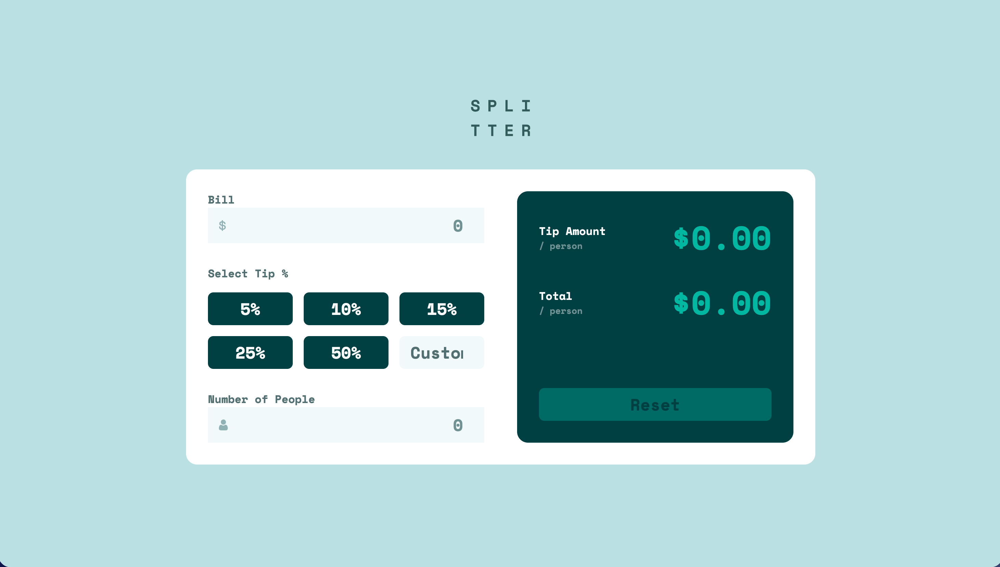

# Frontend Mentor - Tip Calculator App Solution

This is a solution to the Tip Calculator App challenge on Frontend Mentor. The goal of this project was to build a responsive tip calculator and match the provided design as closely as possible.

## Table of contents

- [Overview](#overview)
  - [The challenge](#the-challenge)
  - [Screenshot](#screenshot)
  - [Links](#links)
- [My process](#my-process)
  - [Built with](#built-with)
  - [What I learned](#what-i-learned)
  - [Continued development](#continued-development)
  - [AI Collaboration](#ai-collaboration)
- [Author](#author)

## Overview

### The challenge

Users should be able to:

- View the optimal layout depending on their device's screen size
- See hover and focus states for interactive elements
- Enter a bill amount
- Select a predefined tip percentage
- Enter a custom tip percentage
- Enter the number of people
- Calculate the tip amount per person
- Calculate the total amount per person
- Reset the calculator
- See an error state when the number of people is zero

### Screenshot



### Links

- Solution URL: Add Frontend Mentor solution URL here
- Live Site URL: Add GitHub Pages URL here

## My process

### Built with

- Semantic HTML5 markup
- CSS custom properties
- Flexbox
- CSS Grid
- Mobile-first workflow
- Vanilla JavaScript
- DOM manipulation
- JavaScript event listeners

### What I learned

This project helped me improve my understanding of responsive layouts using CSS Grid and Flexbox.

I also practiced working with form inputs and DOM events in JavaScript. The calculator updates the results based on the bill amount, selected tip percentage, and number of people.

For example, I used `data-*` attributes on the tip buttons:

```html
<button type="button" data-tip="15">15%</button>
```

This allows JavaScript to get the selected percentage without creating separate event handlers for every button:

```js
tipButtons.forEach((button) => {
  button.addEventListener("click", () => {
    selectedTip = Number(button.dataset.tip);
    calculate();
  });
});
```

I also practiced formatting calculated values to two decimal places:

```js
tipAmountOutput.textContent = `$${tipPerPerson.toFixed(2)}`;
totalOutput.textContent = `$${totalPerPerson.toFixed(2)}`;
```

Another thing I learned was how to keep styling and application state separate. JavaScript adds or removes classes such as `selected` and `error`, while CSS controls how those states look.

### Continued development

In future projects, I want to continue improving my JavaScript skills, especially form validation, event handling, and organizing application logic into smaller reusable functions.

I also want to continue improving responsive layouts and writing cleaner, more maintainable CSS.

### AI Collaboration

I used ChatGPT during this project as a learning and debugging assistant.

It helped me:

- Review my HTML and CSS structure
- Identify responsive layout issues
- Understand how to center the application correctly on desktop
- Build and understand the JavaScript calculation logic
- Implement the custom tip, reset button, and validation state
- Review Git and GitHub setup

I used the suggestions alongside my existing code rather than generating the entire project from scratch. This helped me better understand how the individual parts of the application work together.

## Author

- Frontend Mentor - [@doomyhub229](https://www.frontendmentor.io/profile/doomyhub229)
- GitHub - [@doomyhub229](https://github.com/doomyhub229)